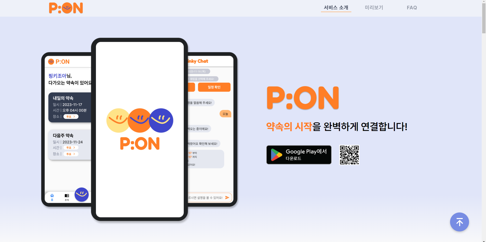
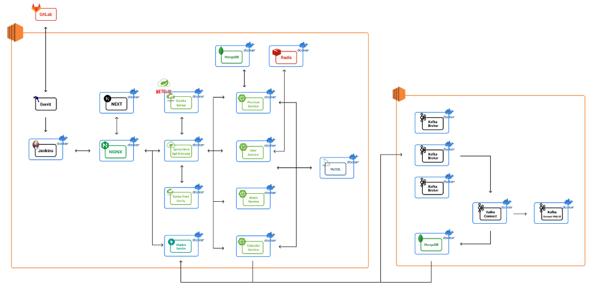

# P:ON (SSAFY 9기 부울경 E102 와니비니)

약속을 시작하는 P:ON 애플리케이션

[White Grey Black Edgy Grunge Anime Game Night Fandom Presentation](https://www.canva.com/design/DAFxqHbt_sc/YMH3Hunoz0-xNMlmZHsIpA/edit)

## 📅 기간

- **2023.08.21 ~ 2023.10.06(7주)**

## 🔎 목차

1. [🎯 기획 배경](#subject)
2. [⭐️ 주요 기능](#mainContents)
3. [⚙️ 시스템 아키텍쳐](#systemArchitecture)
4. [🛠️ 기술 스택](#skills)
5. [🗂️ 파일 구조](#directories)
6. [💾 ERD](#erd)
7. [🖥️ 화면 소개](#contents)
8. [👥 팀원 소개](#developers)
9. [💡 업무 분장](#divisionOfDuties)

 

## 주요 기능

- 약속방: 약속방 생성, 실시간 채팅, 실시간 투표. 공유 캘린더

- 챗봇: 일정 생성, 일정 조회 및 알림

##### 세부 기능

- 일정: 개인 일정 생성, 친구 일정 공유, 친구 일정 확인

- 친구: 유저 검색, 유저 팔로잉, 팔로우/팔로잉 확인

- 유저: 카카오 로그인

- 알림: 약속방, 일정, 친구에 대한 실시간 알림

 

---

## 아키텍처

- 서비스 백/프론트 서버들이 도커 컨테이너로 구성

- 백엔드 서버의 경우 서비스 별로 모두 분리하여 MSA 구조를 이루고 있음.

<a href="#tableContents">목차로 이동</a>

 

## 개발 설정

[Porting Manual](/exec/포팅_매뉴얼.docx) 참고

asd 
